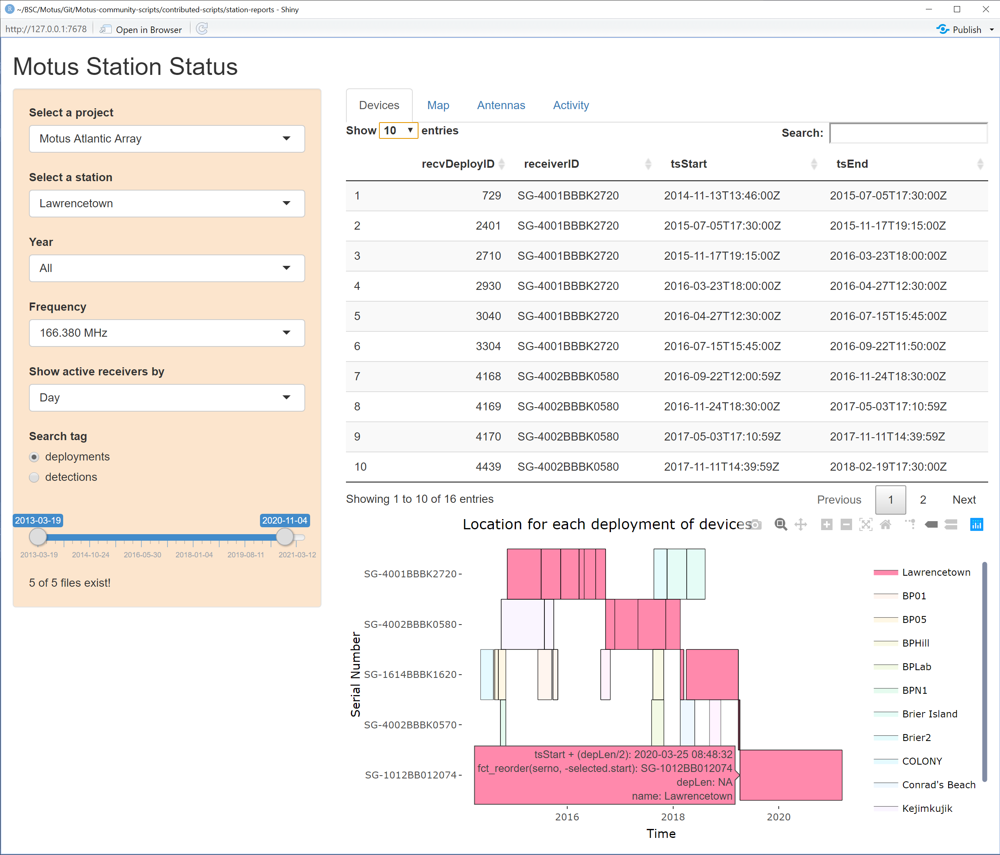
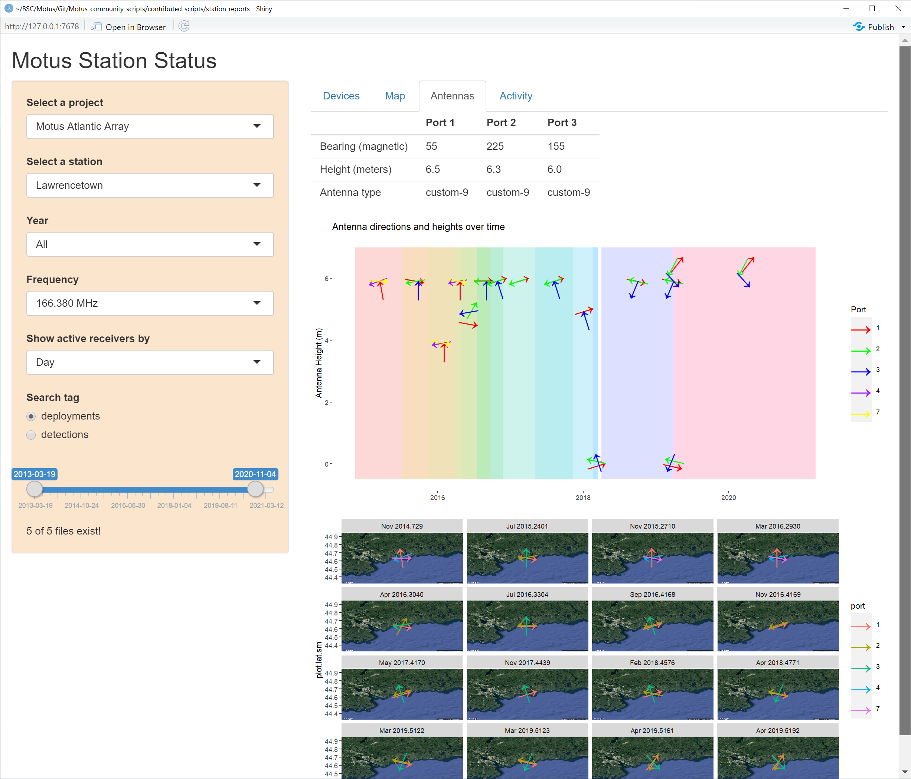
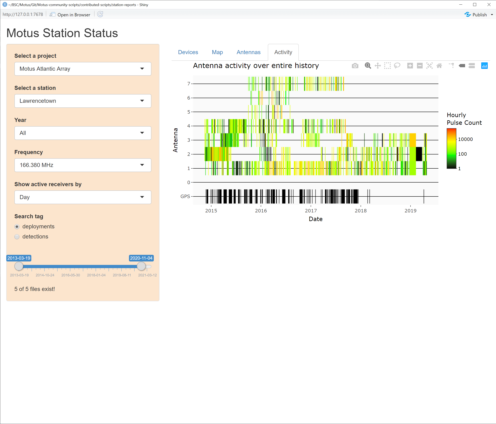

# Station Reports
These scripts can be used to produce Motus station reports for partners and collaborators.

## Setup
Open `downloadData.R` and follow the instructions at the top.

## Making a station reports
Open `makeReport.R` and follow the instructions to make your reports.

[Example report](Lawrencetown-Motus-Station-Report.pdf)

*Tip:* If you have multiple reports to make, you can save each argument of the function in a dataframe and loop through each row like so:
```
df <- read.csv('your.data.frame.csv')

apply(df, 1, function(x){
  makeReport(x[1],x[2],x[3],x[4],x[5],x[6])
})
```

## Shiny app [Beta]
Open `shiny_app.R` and follow the instructions at the top.

*Note:* You must have station data already downloaded before running the app. This can be done using the station report above or through `tagme`.

### Shiny app screenshots

#### Receiver deployment history


#### Antenna deployment history


#### Antenna activity timeline

