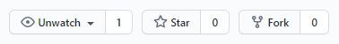
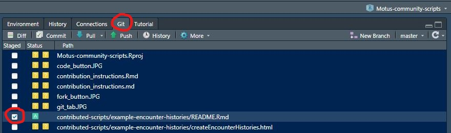
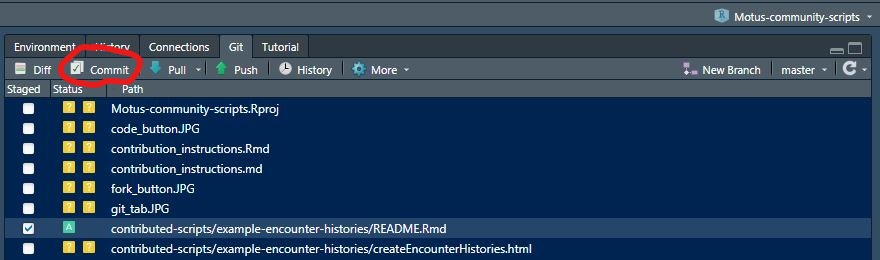
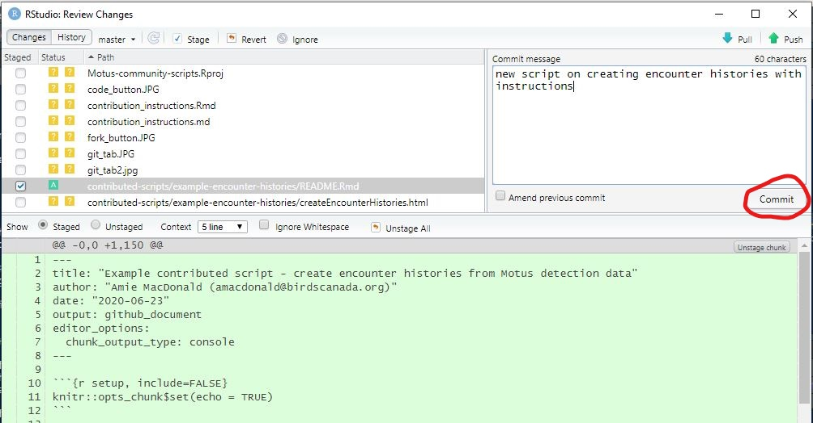
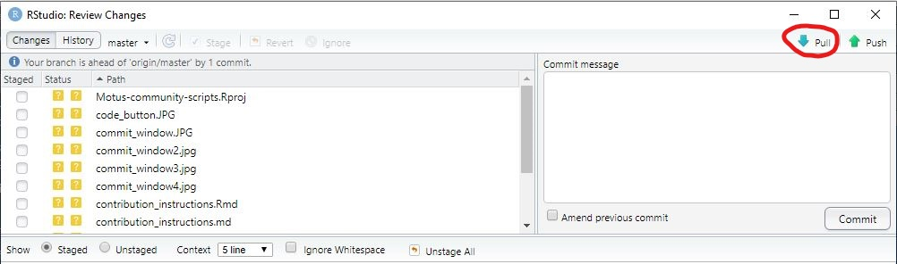
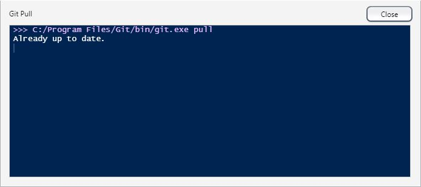
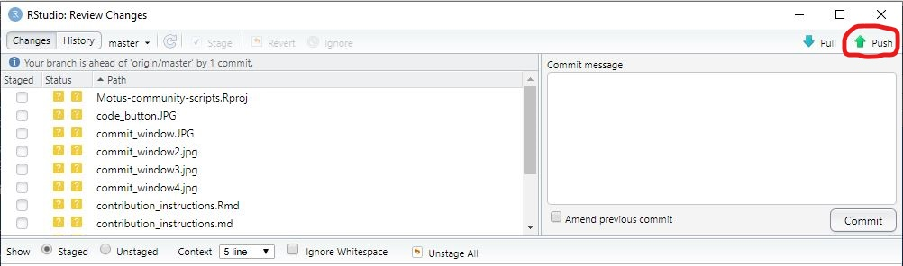
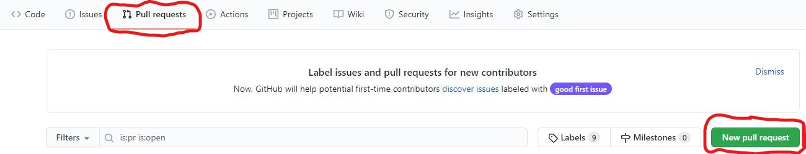
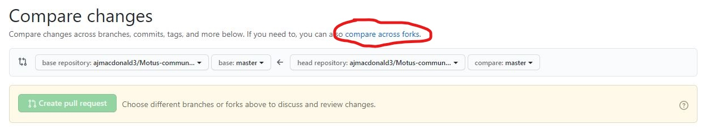

Instructions for contributing scripts through GitHub
================

**Note:** If you would prefer not to use GitHub, you can submit a zip
file with your script, instructions, and any associated files to
<motus@birdscanada.org> and we will upload it to the repository.

## 1\. Create a GitHub account and install Git

If you do not already have one, you will need to create a free [GitHub
account](https://github.com/). You will also need to [install
Git](https://git-scm.com/download/), a version control system that helps
groups work collaboratively.

### Windows

You can download Git for Windows [here](https://git-scm.com/download/).
When installing Git, select “Git from the command line and also from
3rd-party software” when “adjusting you PATH environment”. “Use Git from
Git Bash only” also works in this instance. Otherwise, accept the
defaults.

### MacOS

You can install Git through [Homebrew](https://brew.sh/), a package
manager for command line programs on Mac. Open the terminal
(`~/Application/Utilities/Terminal.app`) and enter the following into
the terminal:

`/bin/bash -c "$(curl -fsSL
https://raw.githubusercontent.com/Homebrew/install/master/install.sh)"`

Press “enter”, then type the following into the terminal:

`brew install git`

### Connect Git and GitHub

Now that you have Git installed and a GitHub account, you need to
connect the two. In RStudio, click on **Tools \> Terminal \> New
Terminal** to launch a shell within RStudio. Check that you are in a Git
Bash shell by entering the following:

`$ echo $SHELL`

Which should result in:

`/usr/bin/bash`

Then enter the following code in the shell and make sure you use the
email associated with your GitHub account:

> `git config --global user.name 'your GitHub username'`

> `git config --global user.email 'youremail@example.com'`

You only need to do this once when you first install Git. You can check
that it worked with:

> `git config --global --list`

## 2\. Fork a copy of the Motus community repository

Forking means making a copy of a repository so that you can make changes
without affecting the original repository. Then once you are ready to
submit your script to the Motus community repository, you can submit a
pull request to merge your copy with your new script to the original
repository.

### Fork the repository on GitHub

Navigate to the [Motus community
repository](https://github.com/ajmacdonald3/Motus-community-scripts) and
click on the **Fork** button in the top right corner of the page.

Now you can navigate to your fork (copy) of the Motus community
repository on your GitHub page.

### Sync your fork with RStudio

You can sync your fork of the Motus community repository with RStudio,
so that it is easier to work on and test code, and you’ll also have a
local copy of the files on your computer. On the page for your fork of
the repository on GitHub, click on the green **Code** button in the
upper right of the page.

Then under **Clone with HTTPS** there is a URL for the repository. Copy
this URL. Now open RStudio and click **File \> New Project \> Version
Control \> Git**, then paste the URL into the **Repository URL** field
and select the folder on your computer where you want the local copy of
the repository to be saved. The **Project directory name** field should
autofill. Once the files have finished copying to your computer, you
should have a **Git** tab in the upper right window of RStudio and the
files should be on your computer. Now you can start adding your script\!

## 3\. Create a new folder for your script

On your computer, navigate to the local copy of the repository using
your usual File Explorer. Open the `contributed-scripts` folder and you
should see folders other Motus users have added with their scripts. Add
a folder for you script and name it according to the topic of your
script (i.e. stopover length, encounter histories, detection maps,
etc.). Save your script (preferably as a `.Rmd` RMarkdown file, but `.R`
scripts are acceptable too) in your new folder. You can continue to work
on and make changes to your script here if needed, as long as you
continue to save the most recent version in the folder you created in
your copy of the Motus community repository. Please make sure your code
is well annotated and that you include instructions on using your code,
so that other Motus users are able to understand what your code does.

## 4\. Commit/pull/push your additions to your GitHub

Now you’ve added your script to your local copy of the repository, but
you still need to upload your changes to your fork on your GitHub before
you can merge them with the original on the Motus community scripts
repository page. In RStudio, select the **Git** tab and you will see a
list of files in your local copy of the repository. Select the
checkbox(es) of the file(s) you added. The yellow question mark boxes
will change to a green A (for “added”) if it is a file that hasn’t yet
been uploaded to GitHub. If you have uploaded a previous version of this
file to GitHub, you’ll see a blue M (for “modified”).

Then click on **Commit**.

This will open a new window. Enter a short commit message describing
what you added or modified and press **Commit**.

It’s good practice to make sure no one else has made changes to the file
before you “push” your changes to GitHub. Since you are working on your
fork of the repository, chances are that you are the only one working on
your fork. Nevertheless, it doesn’t hurt to check. “Pull” the most
recent version of the GitHub repository (your fork on your GitHub page)
onto your local copy on your computer by clicking on **Pull**.

You should see a new window that states that the local copy is up to
date.

Now you can push your changes to your fork of the repository on GitHub.

Now you are ready to share your script in the main Motus community
scripts repository on the MotusWTS GitHub page.

## 5\. Make a pull request to merge with the original repository

Navigate to the original [Motus community scripts
repository](https://github.com/ajmacdonald3/Motus-community-scripts). At
the top, there’s a row of tabs—click on **Pull requests**, then click on
the green **New pull request** button.

On the **Compare changes** page, click **compare across forks**. In the
**base repository** drop-down list, select the original Motus community
scripts repository. In the **head repository** drop-down list, select
your fork, then under **compare**, select the branch you made your
changes in.

Write a title and description for your pull request so that the folks at
Motus know what you are contributing. Once received, Motus will push
your contribution to the main repository so that others can benefit from
your code.

**Note:** If you previously forked the Motus repository to make earlier
changes and are now making new changes later, you should keep your fork
current in case others have made changes in the interim to the
repository.

## Resources

The following resources were useful in compiling these instructions and
offer further in-depth reading on using GitHub and syncing Git and
GitHub with R:

  - [Happy Git and GitHub for the useR](https://happygitwithr.com/)
  - [Intro to GitHub for version
    control](https://ourcodingclub.github.io/tutorials/git/)
  - [Creating a pull request from a
    fork](https://docs.github.com/en/github/collaborating-with-issues-and-pull-requests/creating-a-pull-request-from-a-fork)
